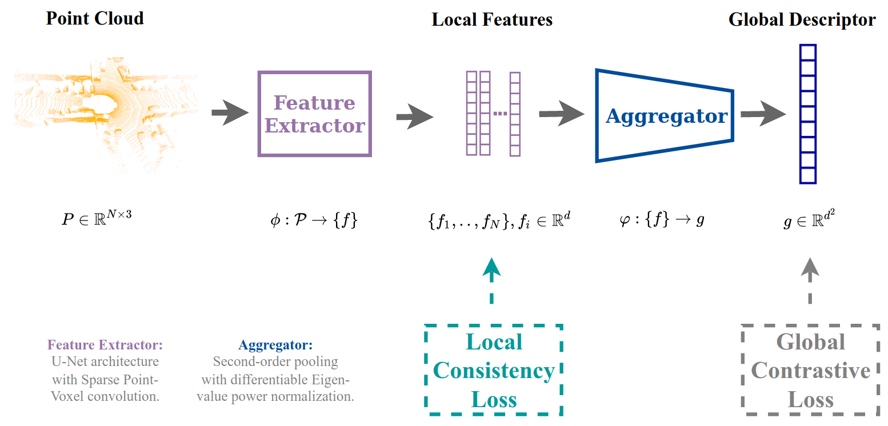
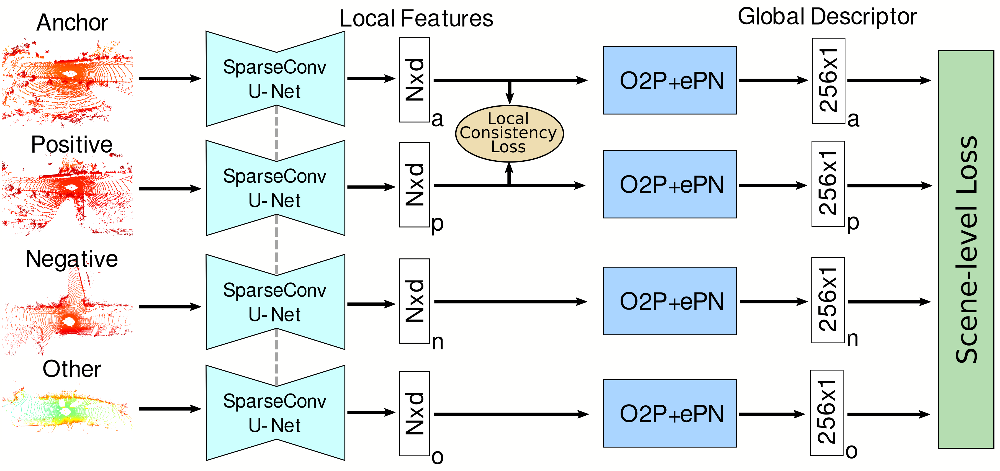

# LoGG3D-Net


This repository is an open-source implementation of the ICRA 2022 paper: [LoGG3D-Net: Locally Guided Global Descriptor Learning for 3D Place Recognition](https://arxiv.org/abs/2109.08336) that won 2nd place at the [General Place Recognition: City-scale UGV 3D Localization Competition - Round 1](https://www.aicrowd.com/challenges/icra2022-general-place-recognition-city-scale-ugv-localization/leaderboards?challenge_round_id=1161). 

- Paper pre-print: https://arxiv.org/abs/2109.08336
- ICRA 2022 presentation: https://www.youtube.com/watch?v=HB6C6RHeYUU
 
We introduce a local consistency loss that can be used in an end-to-end global descriptor learning setting to enforce consistency of the local embeddings extracted from point clouds of the same location. We demonstrate how enforcing this property in the local features contributes towards better performance of the global descriptor in 3D place recognition. We formulate our approach in an end-to-end trainable architecture called *LoGG3D-Net*. 

## News
- [2022-05-25] Won 2nd place at the [General Place Recognition: City-scale UGV 3D Localization Competition](https://www.aicrowd.com/challenges/icra2022-general-place-recognition-city-scale-ugv-localization/leaderboards?challenge_round_id=1161). Watch the invited talk [here](https://www.youtube.com/watch?v=xpEKOyJ7OIU&t=6503s). 
- [2022-05-10] Training code released.
- [2022-02-07] Evaluation code and pretrained models released.


## Method overview
- Joint constraints for local and global descriptors during training. 
- Inference on high-resolution point-clouds using Sparse Point-Voxel convolution to capture fine-grained detail. 
- Feature aggregation using higher-oder pooling to better capture the distribution of local features. 





## Usage

### Set up environment
This project has been tested on a system with Ubuntu 18.04. Main dependencies include:
- [Pytorch](https://pytorch.org/) = 1.10.1
- [TorchSparse](https://github.com/mit-han-lab/torchsparse) = 1.4.0
- [Open3d](https://github.com/isl-org/Open3D) >= 0.13.0

Set up the requirments as follows:
- Create [conda](https://docs.conda.io/en/latest/) environment with python:
```bash
conda create -n logg3d_env python=3.9.4
conda activate logg3d_env
```
- Install PyTorch v1.10.1 with suitable cudatoolkit version. See [here](https://pytorch.org/get-started/previous-versions/#v1101):
```bash
conda install pytorch==1.10.1 torchvision==0.11.2 torchaudio==0.10.1 cudatoolkit=11.1 -c pytorch -c conda-forge
# pytorch versions >= 1.11.0 currently have unexpected behaviour in torch.svd(). Please use and earlier version (eg. 1.10.1).
```
- Install [Open3d](https://github.com/isl-org/Open3D), [Torchpack](https://github.com/zhijian-liu/torchpack) and [mpi4py](https://mpi4py.readthedocs.io/en/stable/tutorial.html):
```bash
pip install -r requirements.txt
```
- Install torchsparse-1.4.0
```bash
sudo apt-get install libsparsehash-dev
pip install --upgrade git+https://github.com/mit-han-lab/torchsparse.git@v1.4.0
```
- Download our pre-trained models from [cloudstor](https://cloudstor.aarnet.edu.au/plus/s/G9z6VzR72TRm09S). Contains 7 checkpoints (6 for Kitti and 1 for MulRan) totalling 741.4 MB. Extract the content into ```./checkpoints/```:
```bash
wget -O checkpoints.zip https://cloudstor.aarnet.edu.au/plus/s/G9z6VzR72TRm09S/download
unzip checkpoints.zip
```
- Download the [KITTI odometry dataset](http://www.cvlibs.net/datasets/kitti/eval_odometry.php), the [MulRan dataset](https://sites.google.com/view/mulran-pr/dataset) and set the paths in ```config/eval_config.py```.
- For the MulRan dataset, create ```scan_poses.csv``` files for each sequence using:
```bash
python ./utils/data_utils/mulran_save_scan_poses.py
```

### Training

Before training:
- Do offline mining of positive pairs for both datasets (at 3m and 20m):
```bash
python utils/data_utils/kitti_tuple_mining.py
python utils/data_utils/mulran_tuple_mining.py
``` 
- Set the number of GPUs available:
```bash
_NGPU=1
```

Training:
- eg. Default training parameters on Kitti:
```bash
torchpack dist-run -np ${_NGPU} python training/train.py \
    --train_pipeline 'LOGG3D' \
    --dataset 'KittiPointSparseTupleDataset'
```
- eg. Default training parameters on MulRan:
```bash
torchpack dist-run -np ${_NGPU} python training/train.py \
    --train_pipeline 'LOGG3D' \
    --dataset 'MulRanPointSparseTupleDataset'
```
- See ```config/train_config.py``` for all other training parameters.

### Evaluation
For KITTI (eg. sequence 06):
```bash
python evaluation/evaluate.py \
    --eval_dataset 'KittiDataset' \
    --kitti_eval_seq 6 \
    --checkpoint_name '/kitti_10cm_loo/2021-09-14_06-43-47_3n24h_Kitti_v10_q29_10s6_262450.pth' \
    --skip_time 30
```
For MulRan (eg. sequence DCC03):  
```bash
python evaluation/evaluate.py \
    --eval_dataset 'MulRanDataset' \
    --mulran_eval_seq 'DCC/DCC_03' \
    --checkpoint_name '/mulran_10cm/2021-09-14_08-59-00_3n24h_MulRan_v10_q29_4s_263039.pth' \
    --skip_time 90
```

Qualitative visualizations of top-1 retrievals on KITTI 08 and MulRan DCC 03:

  

  

Visualization of t-SNE embeddings of the local features extracted using our pre-trained model (on the [CMU AirLab ALITA dataset](https://github.com/MetaSLAM/ALITA)).

  

## Citation

If you find this work usefull in your research, please consider citing:

```
@inproceedings{vid2022logg3d,
  title={LoGG3D-Net: Locally Guided Global Descriptor Learning for 3D Place Recognition},
  author={Vidanapathirana, Kavisha and Ramezani, Milad and Moghadam, Peyman and Sridharan, Sridha and Fookes, Clinton},
  booktitle={IEEE International Conference on Robotics and Automation (ICRA)},
  year={2022},
  eprint={arXiv preprint arXiv:2109.08336}
}
```

## Acknowledgment
Functions from 3rd party have been acknowledged at the respective function definitions or readme files. This project was mainly inspired by the following: [FCGF](https://github.com/chrischoy/FCGF) and [SPVNAS](https://github.com/mit-han-lab/spvnas).

## Contact
For questions/feedback, 
 ```
 kavisha.vidanapathirana@data61.csiro.au
 ```
